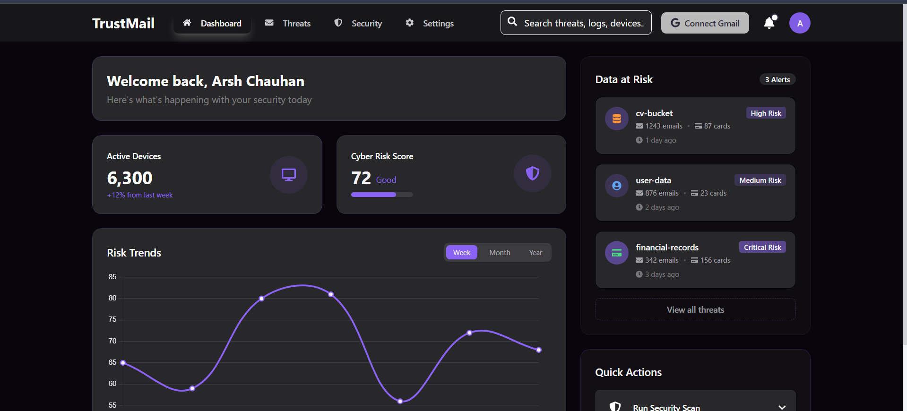

## 🚀 Status

> **Will be Live Soon**  
> This project is currently under development and will be deployed shortly. Stay tuned for updates!

---



# 🛡️ CyberShield — Cybersecurity Monitoring Dashboard

CyberShield is a modern and intuitive cybersecurity monitoring platform designed to help individuals and organizations track digital risk, device security, and data exposure in real time. The application provides centralized monitoring of threats, risk trends, and vulnerable assets while offering actionable recommendations to improve cyber hygiene.

---

## 🚀 Features

### 📊 Interactive Dashboard  
- Personalized welcome screen  
- Overview of active devices, risk score, and alerts  
- Search bar for quick access to logs, threats, and devices  

### 🧩 Data at Risk Overview  
Displays categorized assets detected across the environment along with their risk level and metadata:  
- File categories (example: `cv-bucket`, `user-data`, `financial-records`)  
- Number of exposed items (emails, cards, credentials, etc.)  
- Timestamp of detection  
- Risk labels: **High**, **Medium**, **Critical**

### 📈 Risk Trends Visualization  
Track security posture improvement or degradation over time:  
- Weekly, Monthly, and Yearly visualization modes  
- Line graph showing risk fluctuation  

### ⚙️ Device & Risk Score Tracking  
- Device count monitoring  
- % increase or decrease compared to previous periods  
- Cyber Risk Score ranging from **Poor → Excellent**  

### ⚡ Quick Actions  
- Run automated security scans  
- Apply remediation steps  
- Access detailed threat logs  

---

## 🏗️ Tech Stack

| Category | Technology |
|----------|------------|
| Frontend UI | React / Next.js (suggested), TailwindCSS / MUI |
| Data Visualization | Chart.js / Recharts |
| Authentication | OAuth (Email + Gmail integration) |
| Backend | Node.js / Python (FastAPI) |
| Database | PostgreSQL / MongoDB |
| Threat Intelligence | Custom engine / third-party integrations |

---

## 📦 Installation

```bash
# Clone the repository
git clone https://github.com/yourusername/cybershield.git

# Navigate into project folder
cd cybershield

# Install dependencies
npm install

# Start local development server
npm run dev
